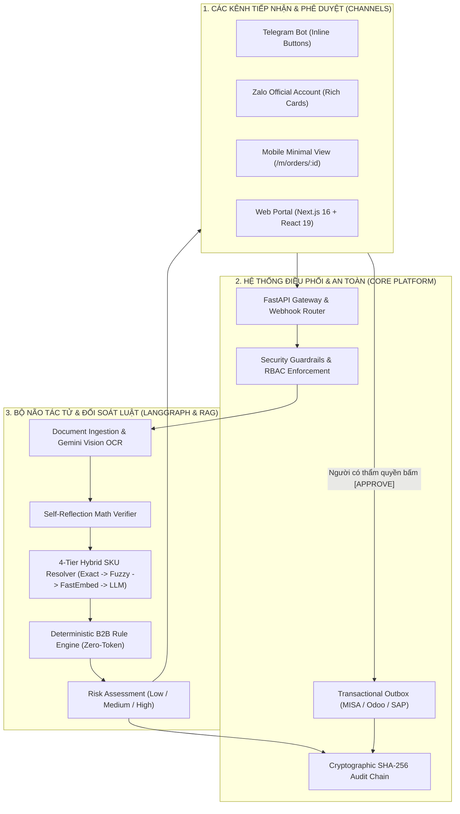

# PO PREFLIGHT — HỆ THỐNG ĐỐI SOÁT & TIỀN KIỂM ĐƠN HÀNG B2B TỰ ĐỘNG

> **Mục tiêu:** Tự động hóa tiếp nhận, kiểm tra tính hợp lệ của đơn hàng (PO) qua quy tắc xác định và suy luận thông minh, hỗ trợ phê duyệt tức thì qua **Telegram, Zalo Official Account, Web Portal** trước khi ghi nhận vào ERP (MISA AMIS, Bravo, Fast, Odoo, SAP B1).

---

## 1. VẤN ĐỀ THỰC TẾ & ĐỘNG LỰC SẢN PHẨM

- Hàng ngày, bộ phận kinh doanh (Sales Admin / Operations) nhận hàng trăm đơn đặt hàng (**Purchase Orders - PO**) từ khách hàng gửi qua nhiều kênh: Email (file PDF, Excel, ảnh chụp scan), tin nhắn Zalo, Telegram.
- **Nỗi đau lớn nhất:**
  1. **Tốn nhân lực & thời gian:** Mất từ 15 - 30 phút cho mỗi đơn hàng để rà soát thủ công: Mã SKU khách viết có đúng không? Giá đặt có đúng theo hợp đồng đã ký? Kho còn đủ hàng không? Khách hàng có bị nợ quá hạn hoặc vượt hạn mức tín dụng không?
  2. **Rủi ro sai sót tai hại:** Nhân viên nhập nhầm giá, bán dưới giá vốn, hoặc đơn hàng của khách nợ xấu vẫn được chuyển cho kho xuất hàng.
  3. **Chi phí sửa sai đắt đỏ:** Khi đơn hàng đã vào ERP, việc hủy hóa đơn VAT, thu hồi hàng từ xe tải, hạch toán điều chỉnh kế toán tốn gấp 10 lần thời gian so với việc chặn lại từ đầu.

- **Giải pháp của PO Preflight:**
  - Đóng vai trò là **"Người gác cổng tiền kiểm" (Preflight Inspector)**: Phân tích, chuẩn hóa và đối soát đơn hàng **trước khi** cho phép đẩy vào ERP.
  - **Phê duyệt di động 1 chạm (Mobile-first Approval):** Quản lý có thể bấm nút **[Duyệt / Từ chối / Yêu cầu sửa]** ngay trên **Telegram, Zalo OA hoặc màn hình di động tối giản** (`/m/orders/:id`).

---

## 2. HIỆN TRẠNG NĂNG LỰC HỆ THỐNG (SYSTEM STATUS)

| Thành phần kỹ thuật | Cơ chế & Công nghệ | Trạng thái hiện tại |
|---|---|---|
| **Bóc tách đa định dạng (Multi-format Intake)** | Parser JSON, CSV, Text + Gemini Flash Vision OCR cho ảnh scan/PDF | **Chạy thật (Production Ready)** |
| **Bảo đảm số học (Math Grounding)** | Self-Reflection Math Verifier (đối soát tổng tiền, thuế VAT, chiết khấu dòng) | **Chạy thật (Production Ready)** |
| **Bộ so khớp SKU 4-Tier Hybrid** | Tier 1 Exact Hash → Tier 2 Fuzzy → Tier 3 FastEmbed Vector → Tier 4 LLM | **Chạy thật (Production Ready)** |
| **Đồ thị điều phối luồng (Stateful Workflow)** | LangGraph StateGraph với SQLite/Postgres Checkpointer & ngắt chờ duyệt HITL | **Chạy thật (Production Ready)** |
| **Động cơ luật B2B (Rules Engine)** | Kiểm tra giá hợp đồng, hạn mức công nợ, tồn kho ATP, MOQ, quy cách đóng gói UOM | **Chạy thật (Production Ready)** |
| **Phê duyệt đa kênh di động (Mobile Approval)** | Telegram Bot Webhook + Zalo OA Rich Interactive Cards + Web `/m/orders/:id` | **Chạy thật (Production Ready)** |
| **Cổng kết nối ERP (ERP Outbox)** | Transactional Outbox Pattern với MISA AMIS Live, Odoo, SAP S/4HANA (Hỗ trợ Dry-run) | **Chạy thật (Production Ready)** |
| **Cơ sở dữ liệu kép (Dual-backend Storage)** | SQLite (WAL mode) cho Edge/On-premise và PostgreSQL cho Cloud với Alembic | **Chạy thật (Production Ready)** |
| **Nhật ký mật mã học (Audit Hash Chain)** | Chuỗi băm SHA-256 tuần tự chống sửa đổi (Tamper-evident Cryptographic Hash Chain) | **Chạy thật (Production Ready)** |
| **Email Intake Worker** | IMAP Poller với khóa phân tán chống xử lý trùng lặp và idempotency | **Chạy thật (Production Ready)** |
| **Kênh phụ trợ Slack & WeChat** | Slack App Block Kit & WeChat Work Webhook | **Kế hoạch mở rộng (Roadmap)** |

---

## 3. KIẾN TRÚC TỔNG THỂ: LANGGRAPH STATEFUL WORKFLOW & ZERO-TOKEN RULES

Dự án áp dụng mô hình kiến trúc phân lớp hiện đại:
1. **Lớp Điều phối & An toàn (FastAPI Gateway & Guardrails):** Quản trị kênh giao tiếp, API, xác thực phiên cookie / API Key, phân quyền RBAC đa cấp bậc, Human-In-The-Loop và kết nối Transactional Outbox.
2. **Bộ não tác tử & Đối soát luật (LangGraph Stateful Brain & Rules Engine):** Quy trình bóc tách tự phản ánh số học, giải quyết mã SKU 4 tầng (RAG Hybrid), kiểm tra bộ quy tắc B2B xác định không phụ thuộc token LLM.



---

## 4. CHI TIẾT BỘ SO KHỚP SKU 4-TIER WATERFALL HYBRID RAG

Để đạt độ chính xác cao nhất với chi phí thấp nhất, hệ thống triển khai chiến lược 4 tầng theo thứ tự ưu tiên:

1. **Tier 1: Exact Matching (Khớp chính xác tuyệt đối)**
   - Hash Lookup trực tiếp từ bảng mã SKU niêm yết và Barcode. Độ trễ: `< 1ms`. Chi phí: `$0`.
2. **Tier 2: Lexical Fuzzy Matching (Khớp mờ ký tự)**
   - Sử dụng thuật toán Levenshtein cải tiến (`RapidFuzz`). Bắt lỗi gõ nhầm ký tự, thiếu dấu gạch ngang, thay thế `O` bằng `0`. Độ trễ: `~5ms`. Chi phí: `$0`.
3. **Tier 3: Semantic Vector Search (Tìm kiếm ngữ nghĩa đa ngữ)**
   - Sử dụng mô hình `FastEmbed` (`paraphrase-multilingual-MiniLM-L12-v2`) chạy hoàn toàn nội bộ (local on-premise). Hiểu tiếng lóng, tên gọi địa phương tiếng Việt (ví dụ: *"dây mạng 3m bấm sẵn"* $\rightarrow$ `CAB-CAT6-3M`). Độ trễ: `~25ms`. Chi phí: `$0`.
4. **Tier 4: LLM Fallback (Suy luận ngôn ngữ lớn)**
   - Kích hoạt chỉ khi 3 tầng trên không đạt ngưỡng tin cậy. Sử dụng Gemini Flash với prompt tối ưu và cấu trúc JSON nghiêm ngặt. Độ trễ: `~450ms`. Chi phí: `~$0.0001 USD / call`.

---

## 5. CƠ CHẾ PHÊ DUYỆT ĐA KÊNH & DI ĐỘNG (MULTI-CHANNEL APPROVAL)

Khi phát hiện đơn hàng có cảnh báo (`Review required` hoặc `Blocked`), hệ thống tạo thẻ tóm tắt trực quan:

```text
┌─────────────────────────────────────────────────────────────────────────────────┐
│                        THẺ BÁO CÁO PHÊ DUYỆT ĐƠN HÀNG                            │
│  Mã đơn: PO-2026-8892                 Khách hàng: Công ty Cổ phần ABC           │
│  Tổng giá trị: 45.200.000 VNĐ         Mức độ rủi ro: ⚠️ MEDIUM RISK             │
│ ─────────────────────────────────────────────────────────────────────────────── │
│  🔍 KẾT QUẢ ĐỐI SOÁT TỰ ĐỘNG:                                                   │
│  1. SKU-101 (Cáp mạng Cat6): Khớp giá hợp đồng | Tồn kho: Đủ (150/100)          │
│  2. SKU-205 (Switch 24p): ⚠️ Giá trên PO (1.8tr) thấp hơn Catalog (2.0tr)       │
│  3. SKU-309 (Đầu bấm RJ45): ✅ Khớp 100% | Tồn kho: Đủ                          │
│  4. Mã đơn: ✅ Chưa từng xuất hiện (Không bị trùng)                             │
│ ─────────────────────────────────────────────────────────────────────────────── │
│          [ ✅ PHÊ DUYỆT (APPROVE) ]        [ ❌ TỪ CHỐI (REJECT) ]               │
│                        [ 💬 YÊU CẦU ĐIỀU CHỈNH ]                                 │
└─────────────────────────────────────────────────────────────────────────────────┘
```

### 5.1. Telegram Bot
- Gửi thông báo HTML kèm Inline Keyboard `[✅ Duyệt Đơn] [❌ Từ Chối] [📝 Yêu Cầu Sửa]`.
- Callback Webhook kiểm tra bí mật chống giả mạo (`X-Telegram-Bot-Api-Secret-Token`).

### 5.2. Zalo Official Account (Zalo OA)
- Gửi thẻ tin nhắn tương tác kèm các nút hành động qua OpenAPI / ZNS.
- Kiểm tra chữ ký HMAC-SHA256 bảo đảm an toàn thông điệp.

### 5.3. Giao diện Di động Tối giản (`/m/orders/:id`)
- Màn hình dành riêng cho duyệt trên điện thoại khi không dùng Telegram/Zalo, hiển thị đầy đủ thông tin đơn hàng, danh sách cảnh báo và 3 nút duyệt lớn kèm ô ghi chú giải trình.

---

## 6. CẤU TRÚC MÃ NGUỒN THỰC TẾ (CODEBASE STRUCTURE)

```text
po-preflight/
├── apps/
│   └── web/                     # Next.js 16 + React 19 Frontend Dashboard & Portal
│       ├── app/(marketing)/     # Trang giới thiệu, bảng giá (/pricing), an ninh (/security)
│       ├── app/(protected)/     # Các màn hình vận hành (/orders, /staging, /reports, /settings)
│       └── app/m/orders/[id]/   # Màn hình phê duyệt di động tối giản
├── src/
│   └── preflight/
│       ├── api/                 # FastAPI REST Gateway & Webhook Endpoints
│       │   └── routes/          # orders, reports, bot, erp, users, rules, ingestion...
│       ├── agent/               # LangGraph Workflow & State Management
│       ├── rag/                 # 4-Tier SKU Matcher & FastEmbed Vector Search
│       ├── rules.py             # Deterministic Rules Engine (B2B checks)
│       ├── erp/                 # Transactional Outbox (MISA, Odoo, SAP)
│       ├── intake/              # Email Intake IMAP Worker & Pipeline
│       ├── security/            # RBAC, Password Hash (Argon2), SHA-256 Audit Chain
│       ├── store.py             # Dual-backend Storage (SQLite WAL / PostgreSQL)
│       └── models.py            # Dataclasses & Domain Models
├── evals/                       # Bộ dữ liệu đo kiểm SKU & Tài liệu PO thực tế
├── tests/                       # Hơn 270 unit tests & integration tests tự động
├── docs/                        # Tài liệu nghiệp vụ, kiến trúc, playbook và security
└── scripts/                     # Script kiểm thử CI/CD (test.sh, demo.sh)
```

---

## 7. BẢO MẬT & TUÂN THỦ NGHỊ ĐỊNH 13/2023/NĐ-CP

- **Không chuyển dữ liệu ra nước ngoài:** Bộ nhúng vector `FastEmbed` và động cơ luật chạy hoàn toàn nội bộ trên máy chủ doanh nghiệp.
- **Chứng thực tính bất biến:** Chuỗi băm SHA-256 kết nối từng sự kiện phân tích và quyết định của con người thành một chuỗi khối mật mã học, cho phép kiểm toán viên xác minh không có can thiệp cơ sở dữ liệu ngầm.
- **Phân định trách nhiệm rõ ràng (SoD):** Tuân thủ tuyệt đối nguyên tắc kiểm soát nội bộ — ngăn chặn tình trạng nhân viên tự tạo và tự duyệt đơn hàng.
