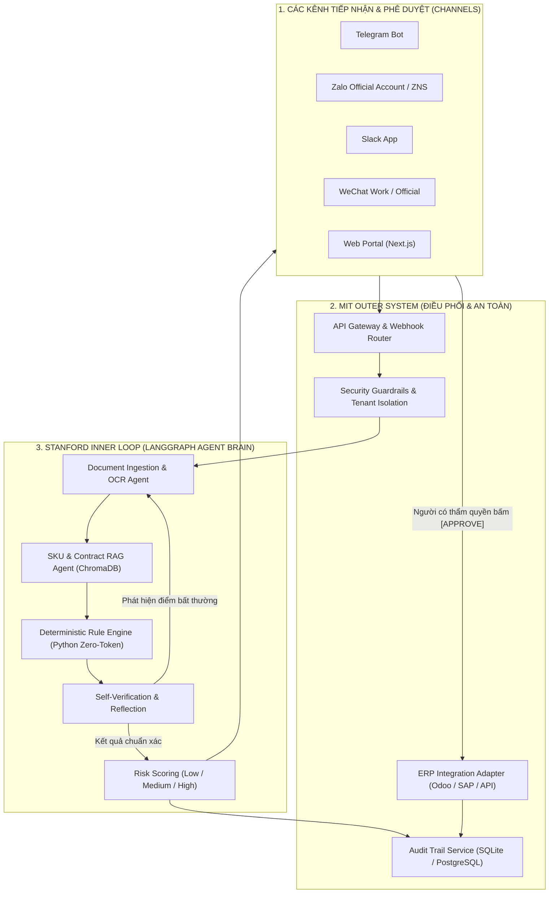
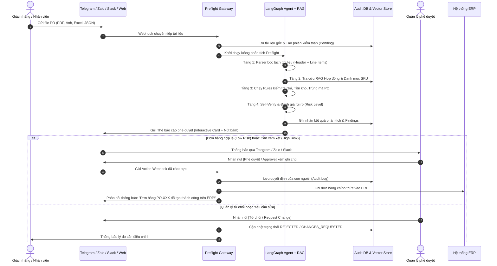

# PO PREFLIGHT: HỆ THỐNG TRỢ LÝ AI ĐỐI SOÁT & PHÊ DUYỆT ĐƠN ĐẶT HÀNG (PURCHASE ORDER) ĐA KÊNH

> **Phiên bản:** 2.0 (Kiến trúc Agentic AI + RAG + Multi-Channel Approval)  
> **Ngôn ngữ:** Tiếng Việt / English  
> **Mục tiêu:** Tự động hóa tiếp nhận, kiểm tra tính hợp lệ của đơn hàng (PO) qua quy tắc xác định và suy luận thông minh, hỗ trợ phê duyệt tức thì qua **Telegram, Zalo, Slack, WeChat, Web Portal** trước khi ghi nhận vào ERP.

---

## 1. Ý NGHĨA & BÀI TOÁN KINH DOANH (BUSINESS VALUE)

### 1.1. Thực trạng tại các doanh nghiệp B2B, Phân phối & Sản xuất
- Hàng ngày, bộ phận kinh doanh (Sales Admin / Operations) nhận hàng trăm đơn đặt hàng (**Purchase Orders - PO**) từ khách hàng gửi qua nhiều kênh: Email (file PDF, Excel, ảnh chụp scan, Word), tin nhắn mạng xã hội (Zalo, WeChat, Telegram, Slack).
- **Thách thức lớn:**
  1. **Nhập liệu thủ công (Manual Data Entry):** Mất 15–30 phút cho mỗi đơn để đọc, đối chiếu từng mã hàng và gõ lại vào hệ thống ERP (SAP, Odoo, Oracle, v.v.).
  2. **Sai lệch giá và chính sách (Price Discrepancy):** Khách đặt theo giá cũ chưa cập nhật, sai mức chiết khấu khối lượng hoặc sai đơn vị tính (hộp / thùng / kiện).
  3. **Thiếu tồn kho & Hàng ngừng kinh doanh (Out of Stock / Inactive SKU):** Đơn vị đặt sản phẩm đã ngừng sản xuất hoặc số lượng vượt quá khả năng đáp ứng của kho hàng.
  4. **Trùng lặp đơn hàng (Duplicate Orders):** Khách gửi lại nhiều lần qua cả email và tin nhắn, dẫn đến nguy cơ xuất kho trùng lặp.
  5. **Quy trình phê duyệt phân tán, chậm trễ:** Quản lý không có mặt tại văn phòng để vào ERP duyệt, dẫn đến ách tắc xử lý đơn hàng.

### 1.2. Giá trị PO Preflight mang lại
- **Giảm 90% thời gian xử lý đơn:** Tự động đọc và bóc tách dữ liệu từ file PO trong vài giây.
- **Loại bỏ 100% lỗi giá & tồn kho trước khi vào ERP:** Đối soát tự động với danh mục sản phẩm, hợp đồng và bảng giá.
- **Phê duyệt mọi lúc mọi nơi (Mobile-first Approval):** Quản lý có thể bấm nút **[Duyệt / Từ chối / Yêu cầu sửa]** ngay trên **Telegram, Zalo, Slack hoặc WeChat**.
- **Nguyên tắc cốt lõi "Human-In-The-Loop":** AI chỉ đóng vai trò trợ lý tiền kiểm toán (preflight), **tuyệt đối không tự ý ghi vào ERP nếu chưa có xác nhận rõ ràng từ con người**.

---

## 2. KIẾN TRÚC TỔNG THỂ: KẾT HỢP MIT OUTER SYSTEM + STANFORD INNER LOOP

Dự án áp dụng mô hình chuẩn quốc tế kết hợp giữa:
1. **MIT Outer System (Hệ thống điều phối & Thực thi giá trị thực):** Quản trị kênh giao tiếp, API, phân quyền, bảo mật, Human-In-The-Loop và kết nối ERP.
2. **Stanford Inner Loop (Bộ não tác tử - Reasoning & Self-Verification):** Quy trình tư duy, tìm kiếm ngữ nghĩa (RAG), tự kiểm tra chéo (Self-Reflection) và sửa sai trước khi ra quyết định.



---

## 3. SƠ ĐỒ LUỒNG XỬ LÝ CHI TIẾT (END-TO-END FLOW)

### 3.1. Sơ đồ tuần tự (Sequence Flow)



---

## 4. CHIẾN LƯỢC TỐI ƯU CHI PHÍ: GIẢM 70% – 90% GỌI LLM

Để hệ thống hoạt động với tốc độ dưới 1 giây và chi phí token gần như bằng 0, dự án áp dụng chiến lược **"Deterministic First, AI as Fallback"**:

```
                              FILE ĐƠN HÀNG (PO)
                                      │
               ┌──────────────────────┴──────────────────────┐
               ▼                                             ▼
    [Dạng bảng có cấu trúc]                       [Dạng phi cấu trúc]
    (JSON, CSV, Excel, Text PDF)                  (Ảnh chụp, Scan, Layout phức tạp)
               │                                             │
               ▼                                             ▼
     Python Parser thuần (0 Token)                 Gọi LLM Vision / Flash (1 lần duy nhất)
               │                                             │
               └──────────────────────┬──────────────────────┘
                                      │
                                      ▼
                   TÌM KIẾM & CHUẨN HÓA MÃ SKU (3 LỚP)
                                      │
       ├── Lớp 1: Exact Match với Catalog DB (0 Token)
       ├── Lớp 2: Fuzzy Search (Levenshtein/BM25 - 0 Token)
       └── Lớp 3: Vector Search (ChromaDB / FAISS - Chi phí cực thấp)
                                      │
                                      ▼
                   KIỂM TRA QUY TẮC NGHIỆP VỤ (0 TOKEN)
                                      │
       ├── So khớp chênh lệch Đơn giá: Python `if/else` (0 Token)
       ├── Đối soát Tồn kho khả dụng: Python `if/else` (0 Token)
       ├── Kiểm tra Trùng lặp Mã đơn: SQL `SELECT 1` (0 Token)
       └── Tính toán Tổng tiền & Thuế: Python Math (0 Token)
                                      │
                                      ▼
                  PHÊ DUYỆT ĐA KÊNH & GHI NHẬN ERP (0 TOKEN)
```

### Các nguyên tắc kỹ thuật then chốt:
1. **Zero-Token Business Rules:** Tuyệt đối không để LLM làm phép tính nhân chia giá tiền hay kiểm tra tồn kho (tránh ảo giác toán học - hallucination).
2. **Single-Pass Structured Extraction:** Khi bắt buộc dùng LLM cho file scan, chỉ gọi **1 lần duy nhất** với đầu ra chuẩn hóa dạng Pydantic / JSON Schema thay vì lặp từng dòng.
3. **Prompt Caching:** Tận dụng bộ nhớ đệm System Prompt và Schema định sẵn để giảm tới 90% chi phí input token.
4. **Mô hình ngôn ngữ nhỏ (SLM):** Sử dụng các mô hình siêu nhẹ và chi phí thấp (Gemini 2.0 Flash / GPT-4o-mini / Claude 3.5 Haiku) cho tác vụ bóc tách văn bản.

---

## 5. TÍCH HỢP PHÊ DUYỆT ĐA KÊNH (MULTI-CHANNEL APPROVAL)

Hệ thống cho phép gửi báo cáo phân tích và nhận lệnh phê duyệt trực tiếp từ nhiều nền tảng:

```
┌─────────────────────────────────────────────────────────────────────────────────┐
│                        THẺ BÁO CÁO PHÊ DUYỆT ĐƠN HÀNG                            │
│  Mã đơn: PO-2026-8892                 Khách hàng: Công ty Cổ phần ABC           │
│  Tổng giá trị: 45.200.000 VNĐ         Mức độ rủi ro: ⚠️ MEDIUM RISK             │
│ ─────────────────────────────────────────────────────────────────────────────── │
│  🔍 KẾT QUẢ ĐỐI SOÁT TỰ ĐỘNG:                                                   │
│  1. SKU-101 (Cáp mạng Cat6): Khớp giá hợp đồng | Tồn kho: Đủ (150/100)          │
│  2. SKU-205 (Switch 24p): ⚠️ Giá trên PO (1.8tr) thấp hơn Catalog (2.0tr)       │
│  3. SKU-309 (Đầu bấm RJ45): ✅ Khớp 100% | Tồn kho: Đủ                          │
│  4. Mã đơn: ✅ Chưa từng xuất hiện (Không bị trùng)                             │
│ ─────────────────────────────────────────────────────────────────────────────── │
│          [ ✅ PHÊ DUYỆT (APPROVE) ]        [ ❌ TỪ CHỐI (REJECT) ]               │
│                        [ 💬 YÊU CẦU ĐIỀU CHỈNH ]                                 │
└─────────────────────────────────────────────────────────────────────────────────┘
```

### 5.1. Telegram
- **Cơ chế:** Sử dụng Telegram Bot API với `InlineKeyboardMarkup` (các nút bấm tương tác Callback).
- **Quy trình:** Khi phát hiện PO, Bot gửi báo cáo dạng Markdown vào Group phê duyệt. Quản lý bấm nút `Approve`, bot cập nhật trạng thái tin nhắn tức thì và kích hoạt ERP sync.

### 5.2. Zalo (Zalo Official Account & Zalo ZNS)
- **Cơ chế:** Gửi tin nhắn tương tác qua Zalo OA OpenAPI hoặc Zalo Notification Service (ZNS) kèm Button Action Webhook.
- **Ưu điểm tại Việt Nam:** Tiện lợi tối đa cho cấp quản lý sử dụng Zalo hàng ngày trên điện thoại.

- **Tích hợp Slack App & Webhooks:** Cho phép gửi tin nhắn thông báo dạng Block Kit và nhận lệnh phê duyệt trực tiếp qua kênh chat.

### 5.4. WeChat (WeChat Work / Enterprise WeChat)
- **Cơ chế:** Sử dụng WeChat Work Webhook Bot với định dạng `template_card` (Interactive Cards).
- **Phục vụ:** Các doanh nghiệp có chuỗi cung ứng hoặc đối tác sản xuất tại thị trường nói tiếng Trung.

### 5.5. Web Portal (Next.js Prototype)
- **Cơ chế:** Bảng điều khiển trung tâm (Dashboard) quản lý toàn bộ hàng đợi đơn hàng, chi tiết từng dòng vi phạm, biểu đồ thời gian thực và lịch sử kiểm toán chi tiết (Audit Trail Timeline).

---

## 6. MÔ HÌNH MULTI-AGENT TEAM VỚI LANGGRAPH

Khi phát triển mở rộng, hệ thống vận hành theo cơ chế phân quyền tác tử:

1. **Ingestion Agent (Multimodal Vision):** Đọc layout, OCR, trích xuất cấu trúc dữ liệu thô.
2. **Catalog & SKU Resolution Agent (RAG):** Tìm kiếm và khớp nối các SKU viết tắt, sai chính tả, mô tả mơ hồ về mã chuẩn của doanh nghiệp.
3. **Contract & Policy Auditor Agent:** Tra cứu bảng giá riêng theo từng khách hàng, điều khoản công nợ và hạn mức tín dụng.
4. **Inventory & Warehouse Agent:** Kiểm tra số lượng tồn kho khả dụng tại từng kho hàng gần nhất, cảnh báo hàng thiếu.
5. **Supervisor & Human-In-The-Loop Agent:** Tổng hợp báo cáo, phân loại mức độ rủi ro (Low / Medium / High), điều phối gửi thông báo qua các kênh chat và quản lý điểm ngắt (`interrupt`) chờ con người bấm duyệt.

---

## 7. CẤU TRÚC THƯ MỤC DỰ ÁN SAU KHI NÂNG CẤP

```text
po-preflight/
├── apps/
│   ├── api/                     # FastAPI Backend (Quản lý Webhook, Auth, State)
│   └── web/                     # Next.js Web Portal (Dashboard & Queue)
├── src/
│   └── preflight/
│       ├── agents/              # LangGraph Agents (Ingestion, RAG, Auditor, Supervisor)
│       ├── channels/            # Module tích hợp đa kênh (Telegram, Zalo, Slack, WeChat)
│       │   ├── telegram.py
│       │   ├── zalo.py
│       │   ├── slack.py
│       │   └── wechat.py
│       ├── rag/                 # Vector Store & Embedding (ChromaDB / SKU Index)
│       ├── parsers.py           # Bộ đọc file nhanh (JSON, CSV, Text, PDF)
│       ├── catalog.py           # Quản lý danh mục & Bảng giá
│       ├── rules.py             # Rule Engine xác định (Zero-Token Validation)
│       ├── models.py            # Pydantic Schemas & Data Contracts
│       ├── store.py             # SQLite / PostgreSQL Audit Trail Store
│       └── cli.py               # Giao diện dòng lệnh CLI
├── docs/
│   ├── MO_TA_DU_AN.md           # Tài liệu mô tả dự án chi tiết (Tiếng Việt)
│   ├── PRD.md                   # Yêu cầu sản phẩm chi tiết
│   ├── architecture.md          # Kiến trúc kỹ thuật và sơ đồ
│   └── ui-specification.md      # Quy chuẩn giao diện người dùng
├── examples/                    # Dữ liệu mẫu (Catalog, Đơn hàng PO JSON/CSV/PDF)
├── tests/                       # Bộ kiểm thử tự động (Unit & Integration Tests)
└── pyproject.toml               # Cấu hình dự án & Dependencies
```

---

## 8. LỘ TRÌNH TRIỂN KHAI (IMPLEMENTATION ROADMAP)

- [x] **Giai đoạn 1 (MVP Hoàn thành):** Bộ đọc file thuần, Rule engine kiểm tra giá/tồn kho/trùng lặp, Audit log SQLite, CLI analyze, Web prototype.
- [ ] **Giai đoạn 2 (RAG & Tối ưu AI):**
  - Tích hợp ChromaDB / FAISS cho Vector Search SKU và Hợp đồng khách hàng.
  - Tích hợp Gemini Flash / Claude Haiku cho bóc tách tài liệu PDF/Ảnh scan phức tạp.
- [ ] **Giai đoạn 3 (LangGraph & Multi-Channel Approval):**
  - Xây dựng LangGraph StateGraph với cơ chế Human-In-The-Loop Interrupt.
  - Tích hợp Bot phê duyệt tương tác qua **Telegram & Zalo OA**.
  - Mở rộng sang **Slack & WeChat Work**.
- [ ] **Giai đoạn 4 (Doanh nghiệp & ERP Production):**
  - Kết nối Adapter ERP chính thức (Odoo API / SAP / Custom REST API).
  - Triển khai hạ tầng AWS bảo mật cao (Terraform, PostgreSQL, S3, Secrets Manager).
