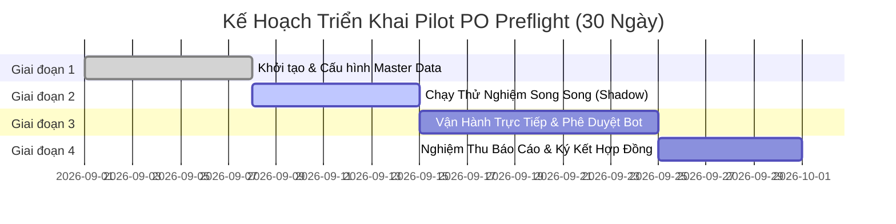

# PO PREFLIGHT — CẨM NANG TRIỂN KHAI PILOT DOANH NGHIỆP (PILOT PLAYBOOK)

> **Tài liệu hướng dẫn triển khai, vận hành và đo lường chương trình Pilot 30 ngày dành cho Doanh nghiệp B2B & Nhà phân phối.**  
> **Phiên bản:** 1.0.0 (Tháng 09/2026) — Nhật Minh Technology

---

## 1. MỤC TIÊU PILOT THEO PRD §18 (PILOT OBJECTIVES & KPIS)

Chương trình Pilot được thiết kế để kiểm chứng giá trị thương mại và hiệu quả kỹ thuật thực tế của hệ thống **PO Preflight** trong môi trường vận hành của khách hàng trước khi ký hợp đồng triển khai mở rộng.

### 1.1. Các chỉ số đo lường cốt lõi (Product Metrics)
| Chỉ số (Metric) | Định nghĩa | Đơn vị đo | Phương pháp thu thập |
|---|---|---|---|
| **Thời gian tiền kiểm (Intake to Analyzed)** | Thời gian từ lúc tiếp nhận tệp PO (Excel/PDF/JSON/Email) đến khi hoàn tất phân tích luật | Giây (s) | Tự động ghi nhận bởi API Gateway (`created_at`) |
| **Thời gian ra quyết định (Turnaround Time)** | Thời gian từ lúc có kết quả phân tích đến khi Quản lý/Giám đốc bấm duyệt | Phút (m) | Chênh lệch giữa `created_at` và `decided_at` trong Audit Log |
| **Tỉ lệ can thiệp của con người (Human Correction Rate)** | Số lượng dòng hàng Sales Admin phải sửa tay / tổng số dòng hàng tiếp nhận | % | Đếm số dòng thay đổi qua màn hình Staging/Inline Edit |
| **Số sự cố chặn trước ERP (Pre-ERP Interception)** | Số đơn hàng vi phạm nghiêm trọng (sai giá hợp đồng, vượt hạn mức nợ, thiếu tồn kho ATP) được ngăn chặn kịp thời | Đơn hàng | Báo cáo từ Rules Engine (`Status = Blocked / Rejected`) |
| **Tỉ lệ đơn trùng lặp (Duplicate Detection)** | Số đơn trùng mã PO hoặc khả nghi trùng lặp được phát hiện | Đơn hàng | Quy tắc `DUPLICATE_PO` / `POSSIBLE_DUPLICATE` |
| **Chi phí hạ tầng AI / đơn hàng (Cost per PO)** | Chi phí token LLM và Vision OCR trung bình trên một đơn hàng | USD / VND | Tổng chi phí API / Tổng số PO xử lý |
| **Tỉ lệ giải quyết 4-Tier SKU** | Phân bổ tỷ lệ khớp SKU theo từng cấp độ: Exact → Fuzzy → Vector → LLM | % | Đo lường hiệu suất SKU Matcher Service |

### 1.2. Mục tiêu cam kết kỳ vọng sau 30 ngày (Target Outcomes)
1. **Giảm ít nhất 70% thời gian rà soát thủ công**: Từ trung bình 25 phút/đơn xuống dưới 2 phút/đơn.
2. **Đảm bảo 100% quyết định phê duyệt có bằng chứng kiểm toán**: Ghi nhận rõ ràng định danh người duyệt (`actor`), cấp bậc (`role`), thời gian và lý do ngoại lệ.
3. **Ngăn chặn 100% đơn hàng sai sót lọt vào ERP**: Không cho phép đơn hàng chưa qua tiền kiểm hoặc đơn hàng bị `Blocked` được đồng bộ sang phần mềm kế toán (MISA AMIS / Odoo / SAP).
4. **Phát hiện 100% đơn hàng trùng lặp**: Triệt tiêu hoàn toàn rủi ro xuất kho trùng hoặc ghi nhận doanh thu ảo.
5. **Chi phí AI tối ưu**: Chi phí suy luận AI trung bình duy trì dưới **$0.0005 USD / đơn hàng**.

---

## 2. HƯỚNG DẪN ĐỌC VÀ PHÂN TÍCH BÁO CÁO PILOT (HOW TO READ REPORTS)

### 2.1. Truy cập và Xuất dữ liệu
- **Giao diện trực quan**: Đăng nhập với quyền `Manager` trở lên, truy cập mục **VẬN HÀNH → Báo cáo Pilot** (`/reports`).
- **Xuất dữ liệu thô**: Bấm nút **"Xuất CSV Báo cáo"** ở góc phải trên cùng để tải tệp `po_preflight_pilot_report.csv` (chuẩn RFC-4180) phục vụ đối soát bảng tính Excel nội bộ.
- **Xem báo cáo qua Email**: Quản trị viên hệ thống nhận email tổng hợp tự động vào thứ Hai hàng tuần hoặc kích hoạt thử nghiệm qua nút **"Gửi Email Tuần"**.

### 2.2. Ý nghĩa và công thức tính toán các chỉ số
```
Thời gian đội ngũ tiết kiệm (Giờ) = Tổng số đơn tiếp nhận × (25 phút - 2 phút) ÷ 60
Tỉ lệ chuẩn hóa tự động (%) = (Tổng đơn - Đơn bị chặn) ÷ Tổng đơn × 100%
Tỉ lệ sửa dòng hàng (%) = Số dòng sửa qua Staging ÷ Tổng dòng hàng × 100%
```

### 2.3. Cách đánh giá biểu đồ hiệu suất RAG 4-Tier
- **Tier 1 (Exact Hash - Xanh lá đậm)**: Khách hàng đặt đúng mã SKU niêm yết (Kỳ vọng: 50% - 60%).
- **Tier 2 (Lexical Fuzzy - Xanh mòng két)**: Khách viết sai chính tả nhẹ, thiếu dấu gạch ngang (Kỳ vọng: 20% - 30%).
- **Tier 3 (Multilingual Dense Vector - Xanh dương)**: Khách dùng tiếng lóng, tên thông dụng tiếng Việt (Kỳ vọng: 10% - 20%).
- **Tier 4 (LLM Fallback - Vàng cam)**: Tên hàng hóa diễn giải phức tạp, cần trí tuệ nhân tạo suy luận ngữ cảnh (Kỳ vọng: < 5% để tối ưu chi phí).

---

## 3. CHECKLIST TRIỂN KHAI 30 NGÀY CHO DOANH NGHIỆP (30-DAY PILOT CHECKLIST)



### Tuần 1 (Ngày 1 - Ngày 7): Onboarding & Khởi tạo Dữ liệu Master
- [ ] Họp Kickoff trực tiếp với Giám đốc Vận hành, Kế toán trưởng và Trưởng nhóm Sales Admin.
- [ ] Xuất và chuẩn hóa bảng Master SKU Catalog (gồm mã SKU, tên chuẩn, đơn vị tính UOM, quy cách đóng gói `pack_size`, MOQ).
- [ ] Nạp danh sách bảng giá hợp đồng khách hàng (`customer_price_agreements`) và hạn mức công nợ (`customer_credit_profiles`).
- [ ] Khởi tạo danh sách người dùng trên hệ thống (`/users`) với đúng phân quyền:
  - `sales_admin`: Tiếp nhận, bóc tách và chỉnh sửa dòng hàng.
  - `manager`: Xem báo cáo, phê duyệt đơn hàng tiêu chuẩn dưới 50 triệu VND.
  - `director`: Phê duyệt đơn hàng giá trị cao hoặc các đơn có ngoại lệ công nợ.
  - `auditor`: Giám sát nhật ký kiểm toán mật mã học.
- [ ] Kết nối bot Telegram và Zalo Official Account cho các cấp quản lý tham gia duyệt.

### Tuần 2 (Ngày 8 - Ngày 14): Chạy thử nghiệm Song song (Shadow Run)
- [ ] Sales Admin tiếp tục quy trình cũ nhưng song song đó tải toàn bộ file PO nhận được vào PO Preflight (`/orders`).
- [ ] Thử nghiệm bóc tách đa định dạng: File Excel chuẩn VAT, bảng tính có chiết khấu, file ảnh scan/PDF hóa đơn.
- [ ] Đối chiếu kết quả bóc tách: Kiểm tra tính năng tự phản ánh số học (Self-Reflection Math Verifier).
- [ ] Kiểm tra các cảnh báo phát hiện: Xác nhận hệ thống có bắt đúng các trường hợp sai giá niêm yết, hết hàng trong kho.
- [ ] Huấn luyện từ vựng SKU Alias: Ghi nhận các tên gọi địa phương của khách hàng vào bộ nhớ của RAG.

### Tuần 3 (Ngày 15 - Ngày 24): Vận hành Trực tiếp & Phê duyệt 1 chạm
- [ ] Chuyển PO Preflight thành cổng tiền kiểm chính thức trước khi ghi nhận đơn hàng.
- [ ] Bật tính năng phê duyệt di động 1 chạm qua Telegram / Zalo Bot hoặc giao diện `/m/orders/:id`.
- [ ] Kích hoạt kết nối Transactional Outbox sang hệ thống ERP (MISA AMIS / Odoo / SAP) ở chế độ ghi nhận thật.
- [ ] Áp dụng triệt để quy tắc: Không có đơn hàng nào vào được ERP nếu chưa có chữ ký duyệt hợp lệ trong Audit Log.

### Tuần 4 (Ngày 25 - Ngày 30): Đánh giá Nghiệm thu & Chuyển giao Thương mại
- [ ] Xuất báo cáo tổng kết Pilot từ trang `/reports` và tải tệp CSV đối soát.
- [ ] Kiểm tra tính toàn vẹn của chuỗi băm mật mã học SHA-256 (`/audit-certificate`).
- [ ] Tiến hành phỏng vấn thực địa Sales Admin và Kế toán trưởng (theo mẫu ở Mục 4).
- [ ] Lập biên bản nghiệm thu Pilot với các số liệu chứng minh ROI cụ thể.
- [ ] Thống nhất phương án ký kết hợp đồng dịch vụ chính thức (SaaS hoặc On-Premises).

---

## 4. MẪU PHỎNG VẤN THỰC ĐỊA SALES ADMIN & KẾ TOÁN TRƯỞNG

Để đảm bảo phần mềm phản ánh đúng thực tế công việc và loại bỏ nỗi lo của người trực tiếp sử dụng, bộ câu hỏi sau được dùng để phỏng vấn đội ngũ vận hành tại các mốc tuần 1, tuần 2 và tuần 4.

### 4.1. Phỏng vấn sau Tuần 1 (Giai đoạn làm quen & Bóc tách)
**Đối tượng:** Sales Admin
1. *Khi tải file PO của khách hàng lên hệ thống (kể cả file Excel định dạng lộn xộn hoặc file ảnh scan), hệ thống bóc tách dữ liệu có nhanh và khớp các cột thông tin không?*
2. *Thao tác chỉnh sửa dòng hàng trực tiếp trên bảng (Inline Edit) có tiện dụng hơn việc mở Excel để copy-paste thủ công không?*
3. *Bạn có gặp khó khăn gì với giao diện tiếng Việt hay các thông báo lỗi trên hệ thống không?*

### 4.2. Phỏng vấn sau Tuần 2 (Giai đoạn kiểm tra Luật & Bắt lỗi)
**Đối tượng:** Sales Admin & Quản lý Đơn hàng
1. *Các cảnh báo về chênh lệch giá, hết tồn kho hay vi phạm hạn mức công nợ có chính xác không? Có trường hợp nào cảnh báo sai (false positive) gây phiền hà không?*
2. *Khi gặp tên hàng khách viết theo cách gọi dân gian, hệ thống gợi ý mã SKU chuẩn có chuẩn xác không?*
3. *Tính năng tính toán số học tự động có giúp bạn phát hiện đơn hàng nào bị lệch tổng tiền hoặc sai thuế VAT do khách tính nhầm không?*

### 4.3. Phỏng vấn sau Tuần 4 (Giai đoạn Nghiệm thu & ROI)
**Đối tượng:** Kế toán trưởng & Giám đốc Vận hành
1. *Trong 30 ngày qua, PO Preflight đã giúp đội ngũ tiết kiệm được khoảng bao nhiêu thời gian mỗi ngày trong việc nhập liệu và soát đơn?*
2. *Hệ thống đã ngăn chặn được bao nhiêu đơn hàng sai giá hoặc khách hàng nợ quá hạn trước khi phát sinh chứng từ kế toán?*
3. *Trải nghiệm phê duyệt đơn hàng giá trị cao trên điện thoại (Zalo/Telegram) có giúp Giám đốc xử lý đơn nhanh hơn khi đi công tác không?*
4. *Bạn đánh giá như thế nào về độ an toàn của nhật ký kiểm toán mã hóa SHA-256 đối với việc giải trình số liệu sau này?*
5. *Theo anh/chị, giá trị lớn nhất mà hệ thống mang lại cho doanh nghiệp là gì, và doanh nghiệp có sẵn sàng chuyển sang hợp đồng chính thức không?*

---
*Tài liệu được biên soạn bởi Đội ngũ Kỹ thuật & Sản phẩm PO Preflight — Nhật Minh Technology.*
