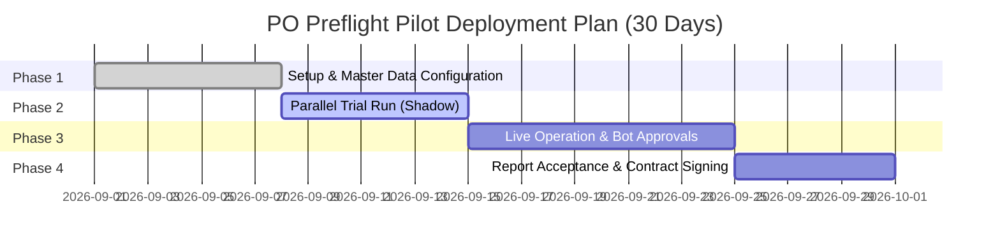

# PO PREFLIGHT — ENTERPRISE PILOT DEPLOYMENT PLAYBOOK

> **A guide to deploying, operating and measuring the 30-day Pilot program for B2B Enterprises & Distributors.**  
> **Version:** 1.0.0 (September 2026) — Nhật Minh Technology

---

## 1. PILOT OBJECTIVES & KPIS PER PRD §18

The Pilot program is designed to validate the commercial value and real-world technical effectiveness of the **PO Preflight** system in the customer's own operating environment, before an expanded deployment contract is signed.

### 1.1. Core measurement metrics (Product Metrics)
| Metric | Definition | Unit | Collection method |
|---|---|---|---|
| **Preflight Time (Intake to Analyzed)** | Time from receiving the PO file (Excel/PDF/JSON/Email) to completing the rules analysis | Seconds (s) | Recorded automatically by the API Gateway (`created_at`) |
| **Decision Time (Turnaround Time)** | Time from when the analysis result is available to when the Manager/Director clicks approve | Minutes (m) | Difference between `created_at` and `decided_at` in the Audit Log |
| **Human Correction Rate** | Number of line items the Sales Admin had to edit by hand / total line items received | % | Count of lines changed via the Staging screen/Inline Edit |
| **Pre-ERP Interception (incidents blocked before the ERP)** | Number of orders with serious violations (wrong contract price, credit limit exceeded, insufficient ATP stock) stopped in time | Orders | Report from the Rules Engine (`Status = Blocked / Rejected`) |
| **Duplicate Detection Rate** | Number of orders with a duplicate PO number or suspected duplicates detected | Orders | Rules `DUPLICATE_PO` / `POSSIBLE_DUPLICATE` |
| **AI Infrastructure Cost per PO (Cost per PO)** | Average LLM token and Vision OCR cost per order | USD / VND | Total API cost / total POs processed |
| **4-Tier SKU Resolution Rate** | Distribution of SKU match rates by tier: Exact → Fuzzy → Vector → LLM | % | Measured from SKU Matcher Service performance |

### 1.2. Expected committed outcomes after 30 days (Target Outcomes)
1. **Reduce manual review time by at least 70%**: From an average of 25 minutes/order to under 2 minutes/order.
2. **Ensure 100% of approval decisions have audit evidence**: Clearly record the approver's identity (`actor`), rank (`role`), time and the reason for any exception.
3. **Stop 100% of erroneous orders from reaching the ERP**: No order that has not passed preflight, or that is `Blocked`, may be synchronized to the accounting software (MISA AMIS / Odoo / SAP).
4. **Detect 100% of duplicate orders**: Completely eliminate the risk of duplicate stock issue or recognition of fictitious revenue.
5. **Optimized AI cost**: Average AI inference cost kept below **$0.0005 USD / order**.

---

## 2. HOW TO READ AND ANALYZE PILOT REPORTS (HOW TO READ REPORTS)

### 2.1. Accessing and exporting data
- **Visual interface**: Log in with `Manager` permission or higher and open **VẬN HÀNH → Báo cáo Pilot** (OPERATIONS → Pilot Reports) (`/reports`).
- **Raw data export**: Click the **"Xuất CSV Báo cáo"** (Export Report CSV) button in the top-right corner to download the `po_preflight_pilot_report.csv` file (RFC-4180 standard) for reconciliation in your internal Excel spreadsheets.
- **Viewing reports by email**: The system administrator receives an automatic summary email every Monday, or can trigger a test send with the **"Gửi Email Tuần"** (Send Weekly Email) button.

### 2.2. Meaning and calculation formulas of the metrics
```
Team time saved (hours) = Total orders received × (25 minutes - 2 minutes) ÷ 60
Auto-normalization rate (%) = (Total orders - Blocked orders) ÷ Total orders × 100%
Line-item correction rate (%) = Lines edited via Staging ÷ Total line items × 100%
```

### 2.3. How to assess the 4-Tier RAG performance chart
- **Tier 1 (Exact Hash - dark green)**: The customer orders using the exact listed SKU code (Expected: 50% - 60%).
- **Tier 2 (Lexical Fuzzy - teal)**: The customer makes slight spelling mistakes or omits hyphens (Expected: 20% - 30%).
- **Tier 3 (Multilingual Dense Vector - blue)**: The customer uses slang or common Vietnamese names (Expected: 10% - 20%).
- **Tier 4 (LLM Fallback - amber-orange)**: Product names that are described in a complex way and need artificial intelligence to reason about context (Expected: < 5% to keep costs optimized).

---

## 3. 30-DAY ENTERPRISE PILOT CHECKLIST (30-DAY PILOT CHECKLIST)



### Week 1 (Day 1 - Day 7): Onboarding & Master Data Setup
- [ ] Hold an in-person Kickoff meeting with the Operations Director, the Chief Accountant and the Sales Admin team lead.
- [ ] Export and standardize the Master SKU Catalog table (including SKU code, standard name, unit of measure UOM, packaging specification `pack_size`, MOQ).
- [ ] Load the customer contract price lists (`customer_price_agreements`) and credit limits (`customer_credit_profiles`).
- [ ] Create the user list in the system (`/users`) with the correct permissions:
  - `sales_admin`: Receives, extracts and edits line items.
  - `manager`: Views reports and approves standard orders under 50 million VND.
  - `director`: Approves high-value orders or orders with a receivables exception.
  - `auditor`: Monitors the cryptographic audit log.
- [ ] Connect the Telegram bot and Zalo Official Account for the management levels taking part in approvals.

### Week 2 (Day 8 - Day 14): Parallel Trial Run (Shadow Run)
- [ ] Sales Admins continue the old process but in parallel upload every PO file they receive into PO Preflight (`/orders`).
- [ ] Test multi-format extraction: standard VAT Excel files, spreadsheets with discounts, scanned image files/PDF invoices.
- [ ] Cross-check the extraction results: Verify the Self-Reflection Math Verifier feature.
- [ ] Verify the detection warnings: Confirm that the system correctly catches cases of wrong list prices and out-of-stock items.
- [ ] Train the SKU Alias vocabulary: Record customers' local names for products into the RAG memory.

### Week 3 (Day 15 - Day 24): Live Operation & 1-Touch Approval
- [ ] Switch PO Preflight to be the official preflight gateway before orders are recorded.
- [ ] Enable 1-touch mobile approval via Telegram / Zalo Bot or the `/m/orders/:id` interface.
- [ ] Activate the Transactional Outbox connection to the ERP system (MISA AMIS / Odoo / SAP) in real recording mode.
- [ ] Apply the rule strictly: No order may enter the ERP without a valid approval signature in the Audit Log.

### Week 4 (Day 25 - Day 30): Acceptance Review & Commercial Handover
- [ ] Export the Pilot summary report from the `/reports` page and download the reconciliation CSV file.
- [ ] Check the integrity of the SHA-256 cryptographic hash chain (`/audit-certificate`).
- [ ] Conduct field interviews with the Sales Admins and the Chief Accountant (using the template in Section 4).
- [ ] Prepare the Pilot acceptance record with concrete figures demonstrating ROI.
- [ ] Agree on the plan for signing the official service contract (SaaS or On-Premises).

---

## 4. FIELD INTERVIEW TEMPLATE FOR SALES ADMINS & CHIEF ACCOUNTANT

To make sure the software reflects real working conditions and removes the concerns of the people who use it directly, the following question set is used to interview the operations team at the week 1, week 2 and week 4 milestones.

### 4.1. Interview after Week 1 (Familiarization & Extraction phase)
**Audience:** Sales Admin
1. *When you upload a customer's PO file to the system (including messily formatted Excel files or scanned image files), is the data extraction fast, and does it match the information columns?*
2. *Is editing line items directly in the table (Inline Edit) more convenient than opening Excel to copy and paste by hand?*
3. *Do you have any difficulty with the Vietnamese-language interface or the error messages in the system?*

### 4.2. Interview after Week 2 (Rule verification & Error catching phase)
**Audience:** Sales Admin & Order Manager
1. *Are the warnings about price discrepancies, out-of-stock items or credit limit violations accurate? Were there any false positive warnings that caused trouble?*
2. *When a customer writes a product name in colloquial terms, are the standard SKU codes the system suggests accurate?*
3. *Does the automatic arithmetic calculation feature help you spot orders whose totals are off or whose VAT is wrong because the customer miscalculated?*

### 4.3. Interview after Week 4 (Acceptance & ROI phase)
**Audience:** Chief Accountant & Operations Director
1. *Over the past 30 days, roughly how much time per day has PO Preflight saved the team on data entry and order review?*
2. *How many orders with wrong prices, or from customers with overdue debt, has the system stopped before any accounting document was generated?*
3. *Has approving high-value orders on the phone (Zalo/Telegram) helped the Director handle orders faster while on business trips?*
4. *How do you rate the safety of the SHA-256 encrypted audit log for explaining figures later on?*
5. *In your view, what is the greatest value the system brings to the business, and is the business ready to move to an official contract?*

---
*Prepared by the PO Preflight Engineering & Product Team — Nhật Minh Technology.*
