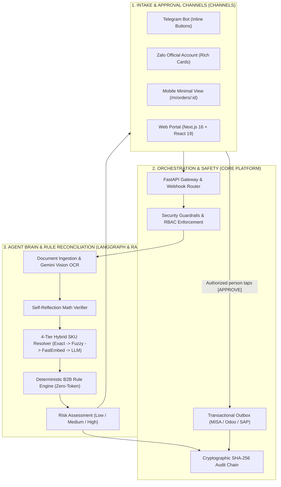

# PO PREFLIGHT — AUTOMATED B2B ORDER RECONCILIATION & PRE-CHECK SYSTEM

> **Objective:** Automate the intake and validity checking of purchase orders (POs) through deterministic rules and intelligent reasoning, enabling instant approval via **Telegram, Zalo Official Account and the Web Portal** before the order is posted to the ERP (MISA AMIS, Bravo, Fast, Odoo, SAP B1).

---

## 1. REAL-WORLD PROBLEM & PRODUCT MOTIVATION

- Every day, the sales department (Sales Admin / Operations) receives hundreds of purchase orders (**Purchase Orders - PO**) from customers through many channels: email (PDF files, Excel files, scanned photos), Zalo messages and Telegram.
- **The biggest pain points:**
  1. **Labor and time cost:** It takes 15 - 30 minutes per order to review manually: Is the SKU code the customer wrote correct? Is the ordered price the one in the signed contract? Is there enough stock? Is the customer overdue on payments or over their credit limit?
  2. **Risk of damaging errors:** Staff enter the wrong price, sell below cost, or an order from a customer with bad debt still gets passed to the warehouse for shipment.
  3. **Expensive error correction:** Once an order is in the ERP, cancelling the VAT invoice, recalling goods from the truck and posting accounting adjustments takes 10 times longer than stopping it at the start.

- **The PO Preflight solution:**
  - Acts as the **"Preflight Inspector" gatekeeper**: analyzes, normalizes and reconciles the order **before** it may be pushed into the ERP.
  - **1-tap Mobile-first Approval:** Managers can tap **[Approve / Reject / Request Changes]** directly on **Telegram, Zalo OA or the minimal mobile screen** (`/m/orders/:id`).

---

## 2. SYSTEM CAPABILITY STATUS

| Technical Component | Mechanism & Technology | Current Status |
|---|---|---|
| **Multi-format Intake** | JSON, CSV and text parsers + Gemini Flash Vision OCR for scanned images/PDFs | **Live (Production Ready)** |
| **Math Grounding** | Self-Reflection Math Verifier (reconciles totals, VAT and line-level discounts) | **Live (Production Ready)** |
| **4-Tier Hybrid SKU Matcher** | Tier 1 Exact Hash → Tier 2 Fuzzy → Tier 3 FastEmbed Vector → Tier 4 LLM | **Live (Production Ready)** |
| **Stateful Workflow (orchestration graph)** | LangGraph StateGraph with SQLite/Postgres Checkpointer & HITL pause awaiting approval | **Live (Production Ready)** |
| **B2B Rules Engine** | Checks contract prices, credit limits, ATP stock, MOQ and UOM packaging units | **Live (Production Ready)** |
| **Multi-channel Mobile Approval** | Telegram Bot Webhook + Zalo OA Rich Interactive Cards + Web `/m/orders/:id` | **Live (Production Ready)** |
| **ERP Connection Gateway (ERP Outbox)** | Transactional Outbox Pattern with MISA AMIS Live, Odoo, SAP S/4HANA (Dry-run supported) | **Live (Production Ready)** |
| **Dual-backend Storage** | SQLite (WAL mode) for Edge/On-premise and PostgreSQL for Cloud with Alembic | **Live (Production Ready)** |
| **Cryptographic Audit Log (Audit Hash Chain)** | Sequential SHA-256 hash chain that resists modification (Tamper-evident Cryptographic Hash Chain) | **Live (Production Ready)** |
| **Email Intake Worker** | IMAP Poller with a distributed lock that prevents duplicate processing, and idempotency | **Live (Production Ready)** |
| **Auxiliary Slack & WeChat Channels** | Slack App Block Kit & WeChat Work Webhook | **Planned expansion (Roadmap)** |

---

## 3. OVERALL ARCHITECTURE: LANGGRAPH STATEFUL WORKFLOW & ZERO-TOKEN RULES

The project adopts a modern layered architecture:
1. **Orchestration & Safety Layer (FastAPI Gateway & Guardrails):** Manages communication channels, the API, cookie-session / API Key authentication, multi-level RBAC authorization, Human-In-The-Loop, and the Transactional Outbox connection.
2. **Agent Brain & Rule Reconciliation (LangGraph Stateful Brain & Rules Engine):** A self-reflecting arithmetic extraction workflow, 4-tier SKU resolution (Hybrid RAG), and deterministic B2B rule checks that do not depend on LLM tokens.



---

## 4. THE 4-TIER WATERFALL HYBRID RAG SKU MATCHER IN DETAIL

To achieve the highest accuracy at the lowest cost, the system implements a 4-tier strategy in priority order:

1. **Tier 1: Exact Matching (absolute exact match)**
   - Direct hash lookup against the listed SKU table and barcodes. Latency: `< 1ms`. Cost: `$0`.
2. **Tier 2: Lexical Fuzzy Matching (character-level fuzzy match)**
   - Uses an enhanced Levenshtein algorithm (`RapidFuzz`). Catches mistyped characters, missing hyphens, and `O` substituted for `0`. Latency: `~5ms`. Cost: `$0`.
3. **Tier 3: Semantic Vector Search (multilingual semantic search)**
   - Uses the `FastEmbed` model (`paraphrase-multilingual-MiniLM-L12-v2`), running entirely locally on-premise. Understands slang and local Vietnamese product names (e.g., *"dây mạng 3m bấm sẵn"* (pre-crimped 3 m network cable) $\rightarrow$ `CAB-CAT6-3M`). Latency: `~25ms`. Cost: `$0`.
4. **Tier 4: LLM Fallback (large language model reasoning)**
   - Triggered only when the three tiers above fail to reach the confidence threshold. Uses Gemini Flash with an optimized prompt and a strict JSON structure. Latency: `~450ms`. Cost: `~$0.0001 USD / call`.

---

## 5. MULTI-CHANNEL & MOBILE APPROVAL MECHANISM

When an order with warnings (`Review required` or `Blocked`) is detected, the system generates a visual summary card:

```text
┌─────────────────────────────────────────────────────────────────────────────────┐
│                           ORDER APPROVAL REPORT CARD                            │
│ Order ID: PO-2026-8892            Customer: Công ty Cổ phần ABC (ABC JSC)       │
│ Total value: 45,200,000 VND       Risk level: ⚠️ MEDIUM RISK                     │
│ ─────────────────────────────────────────────────────────────────────────────── │
│ 🔍 AUTOMATED CROSS-CHECK RESULTS:                                               │
│ 1. SKU-101 (Cáp mạng Cat6 = Cat6 cable): Price OK | Stock: Sufficient (150/100) │
│ 2. SKU-205 (Switch 24p = 24-port): ⚠️ PO price (1.8M) is below Catalog (2.0M)    │
│ 3. SKU-309 (Đầu bấm RJ45 = RJ45 plug): ✅ 100% match | Stock: Sufficient        │
│ 4. Order ID: ✅ Never seen before (no duplicate)                                │
│ ─────────────────────────────────────────────────────────────────────────────── │
│                       [ ✅ APPROVE ]        [ ❌ REJECT ]                       │
│                             [ 💬 REQUEST CHANGES ]                              │
└─────────────────────────────────────────────────────────────────────────────────┘
```

### 5.1. Telegram Bot
- Sends an HTML notification with an Inline Keyboard `[✅ Duyệt Đơn] [❌ Từ Chối] [📝 Yêu Cầu Sửa]` (Approve Order / Reject / Request Changes).
- The callback webhook verifies a secret to prevent spoofing (`X-Telegram-Bot-Api-Secret-Token`).

### 5.2. Zalo Official Account (Zalo OA)
- Sends interactive message cards with action buttons via OpenAPI / ZNS.
- Verifies the HMAC-SHA256 signature to guarantee message integrity.

### 5.3. Minimal Mobile Interface (`/m/orders/:id`)
- A screen dedicated to approving on a phone when Telegram/Zalo is not used, showing the complete order information, the list of findings, and 3 large approval buttons with a field for an explanatory note.

---

## 6. ACTUAL CODEBASE STRUCTURE

```text
po-preflight/
├── apps/
│   └── web/                     # Next.js 16 + React 19 Frontend Dashboard & Portal
│       ├── app/(marketing)/     # Marketing pages, pricing (/pricing), security (/security)
│       ├── app/(protected)/     # Operational screens (/orders, /staging, /reports, /settings)
│       └── app/m/orders/[id]/   # Minimal mobile approval screen
├── src/
│   └── preflight/
│       ├── api/                 # FastAPI REST Gateway & Webhook Endpoints
│       │   └── routes/          # orders, reports, bot, erp, users, rules, ingestion...
│       ├── agent/               # LangGraph Workflow & State Management
│       ├── rag/                 # 4-Tier SKU Matcher & FastEmbed Vector Search
│       ├── rules.py             # Deterministic Rules Engine (B2B checks)
│       ├── erp/                 # Transactional Outbox (MISA, Odoo, SAP)
│       ├── intake/              # Email Intake IMAP Worker & Pipeline
│       ├── security/            # RBAC, Password Hash (Argon2), SHA-256 Audit Chain
│       ├── store.py             # Dual-backend Storage (SQLite WAL / PostgreSQL)
│       └── models.py            # Dataclasses & Domain Models
├── evals/                       # SKU benchmark datasets & real-world PO documents
├── tests/                       # 270+ automated unit tests & integration tests
├── docs/                        # Business, architecture, playbook and security docs
└── scripts/                     # CI/CD test scripts (test.sh, demo.sh)
```

---

## 7. SECURITY & COMPLIANCE WITH DECREE NO. 13/2023/ND-CP

- **No data transferred abroad:** The `FastEmbed` vector embedder and the rules engine run entirely on-premise on the enterprise's own servers.
- **Immutability attestation:** The SHA-256 hash chain links every analysis event and human decision into a cryptographic chain, allowing auditors to verify that there has been no covert database tampering.
- **Clear Separation of Duties (SoD):** Strictly adheres to the internal control principle, preventing employees from both creating and approving the same order.
