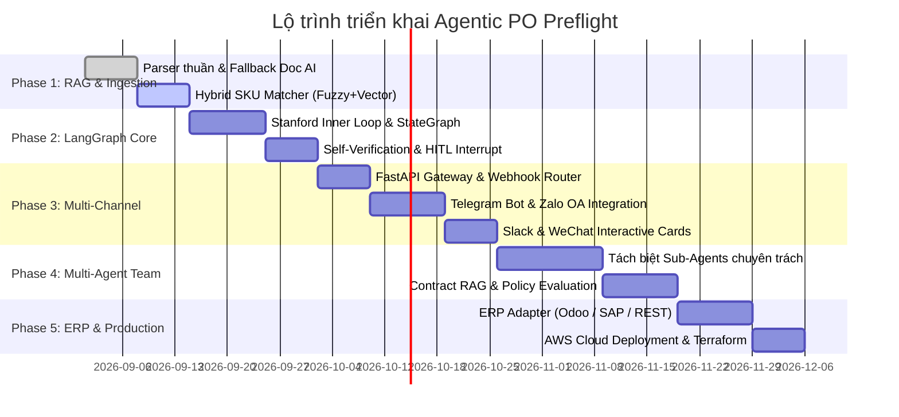

# LỘ TRÌNH TRIỂN KHAI DỰ ÁN PO PREFLIGHT (AGENTIC AI ROADMAP)

> **Mục tiêu:** Xây dựng hệ thống Agentic AI đối soát đơn hàng (PO) tự động, kết hợp RAG, LangGraph (Stanford Inner Loop + MIT Outer System), tối ưu chi phí LLM và phê duyệt đa kênh qua Telegram, Zalo, Slack, WeChat, Web Portal.

---

---

## 🎯 CHI TIẾT CÁC GIAI ĐOẠN (PHASES)

### 📌 GIAI ĐOẠN 1: INGESTION HYBRID & HYBRID SKU RAG (Tuần 1 - Tuần 2)
*Mục tiêu: Đọc được mọi loại file đơn hàng (PDF text, PDF scan, Excel, Ảnh, JSON) và tìm kiếm mã SKU thông minh với chi phí token gần bằng 0.*

- [x] **1.1. Deterministic Parsers:** Giữ nguyên parser Python thuần cho JSON, CSV, text PDF (0 token).
- [ ] **1.2. Multimodal Fallback:** Tích hợp `gemini-2.0-flash` hoặc `gpt-4o-mini` với Pydantic Structured Output cho file ảnh/scan phức tạp (chỉ kích hoạt khi parser thuần thất bại).
- [ ] **1.3. Hybrid SKU Matcher (3 tầng):**
  - *Tầng 1 (Exact Match):* Tra cứu mã SKU trực tiếp trong catalog (0 token).
  - *Tầng 2 (Fuzzy Match):* Sử dụng `rapidfuzz` / Levenshtein Distance để bắt lỗi chính tả nhẹ (0 token).
  - *Tầng 3 (Vector Search):* Tích hợp `ChromaDB` / `FastEmbed` để đối soát ngữ nghĩa tên sản phẩm viết tắt hoặc mô tả tự do.
- **Tiêu chí hoàn thành (Deliverables):**
  - Tỷ lệ nhận diện SKU đúng > 98%.
  - Chi phí xử lý cho file chuẩn = $0, file ảnh scan < $0.002/đơn.

---

### 📌 GIAI ĐOẠN 2: LANGGRAPH SINGLE-AGENT & HITL (Tuần 3 - Tuần 4)
*Mục tiêu: Xây dựng đồ thị điều phối LangGraph theo kiến trúc Stanford Inner Loop (Reasoning + Self-Verification).*

- [ ] **2.1. LangGraph StateGraph Architecture:**
  - Định nghĩa trạng thái `POState` (raw_file, extracted_items, findings, risk_level, human_decision, audit_trail).
- [ ] **2.2. Deterministic Rule Node (Zero-Token):**
  - Tích hợp `rules.py` vào đồ thị để kiểm tra chênh lệch đơn giá, thiếu tồn kho, trùng mã PO.
- [ ] **2.3. Self-Verification & Reflection Node:**
  - Kiểm tra tính toán chéo: Tổng tiền các dòng có khớp với `Grand Total` trên file PO không?
  - Nếu không khớp $\rightarrow$ Kích hoạt Inner Loop tự đọc lại vùng bị lệch.
- [ ] **2.4. Human-In-The-Loop (HITL) Interrupt:**
  - Cấu hình `MemorySaver` / `PostgresSaver` và điểm dừng `interrupt_before=["human_approval"]` khi rủi ro ở mức `MEDIUM` hoặc `HIGH`.
- **Tiêu chí hoàn thành (Deliverables):**
  - Graph chạy mượt mà từ bóc tách $\rightarrow$ kiểm tra rules $\rightarrow$ dừng chờ lệnh duyệt $\rightarrow$ tiếp tục luồng.

---

### 📌 GIAI ĐOẠN 3: PHÊ DUYỆT ĐA KÊNH (MULTI-CHANNEL APPROVAL) (Tuần 5 - Tuần 7)
*Mục tiêu: Đưa trải nghiệm phê duyệt đơn hàng lên Telegram, Zalo, Slack, WeChat và Web Portal.*

- [ ] **3.1. FastAPI Webhook Gateway:**
  - Xây dựng REST API tiếp nhận webhook từ các nền tảng chat, xác thực chữ ký bảo mật (HMAC SHA-256).
- [ ] **3.2. Telegram Bot Integration:**
  - Gửi thẻ PO dạng Markdown kèm `InlineKeyboardMarkup` (`[Duyệt]`, `[Từ chối]`, `[Yêu cầu chỉnh sửa]`).
  - Xử lý Callback Query khi quản lý bấm nút $\rightarrow$ Resume LangGraph state.
- [ ] **3.3. Zalo Official Account & ZNS:**
  - Tích hợp gửi tin nhắn Zalo kèm nút thao tác (phù hợp tối đa cho doanh nghiệp tại Việt Nam).
- [ ] **3.4. Slack App & WeChat Work:**
  - Tích hợp Slack Block Kit và WeChat Template Cards.
- [ ] **3.5. Web Portal Dashboard (`apps/web`):**
  - Kết nối giao diện React/Next.js với FastAPI để hiển thị danh sách đơn chờ duyệt và lịch sử Audit Log theo thời gian thực.
- **Tiêu chí hoàn thành (Deliverables):**
  - Quản lý có thể bấm duyệt đơn trực tiếp trên điện thoại qua Telegram/Zalo trong dưới 3 giây.

---

### 📌 GIAI ĐOẠN 4: MULTI-AGENT COLLABORATION TEAM (Tuần 8 - Tuần 10)
*Mục tiêu: Phân quyền tác tử chuyên trách cho các nghiệp vụ phức tạp của doanh nghiệp lớn.*

- [ ] **4.1. Ingestion Agent (Vision/Document AI):** Chuyên bóc tách và chuẩn hóa layout.
- [ ] **4.2. Catalog & SKU Resolution Agent (RAG):** Chuyên giải quyết mã hàng, quy cách đóng gói (hộp/thùng).
- [ ] **4.3. Contract & Policy Auditor Agent:**
  - RAG tra cứu Hợp đồng nguyên tắc: Chiết khấu khối lượng, hạn mức công nợ (Credit limits), điều khoản thanh toán (Net 30/60).
- [ ] **4.4. Inventory & Warehouse Agent:** Kiểm tra tồn kho đa chi nhánh/kho hàng.
- [ ] **4.5. Supervisor / HITL Coordinator Agent:** Tổng hợp báo cáo và phân phối quyền duyệt theo hạn mức giá trị đơn hàng.
- **Tiêu chí hoàn thành (Deliverables):**
  - Hệ thống tự động phân loại người có thẩm quyền duyệt (ví dụ: đơn > 100tr chuyển tới Giám đốc kinh doanh).

---

### 📌 GIAI ĐOẠN 5: KẾT NỐI ERP & TRIỂN KHAI PRODUCTION (Tuần 11 - Tuần 12)
*Mục tiêu: Tích hợp ghi đơn tự động vào ERP và triển khai hạ tầng đám mây bảo mật cao.*

- [ ] **5.1. ERP Adapters:**
  - Xây dựng connector ghi Sales Order vào Odoo (XML-RPC / REST API), SAP Business One, hoặc Custom Database.
  - Cơ chế Idempotency Key chống ghi trùng lặp và hỗ trợ Rollback khi gặp sự cố mạng.
- [ ] **5.2. Audit Trail & Compliance:**
  - Lưu trữ bất biến (Immutable) toàn bộ lịch sử: Người duyệt, thời gian, IP, file gốc, kết quả bóc tách vào PostgreSQL.
- [ ] **5.3. AWS Cloud Deployment:**
  - Terraform tự động dựng VPC, EC2/ECS, RDS PostgreSQL, S3 Encrypted Documents, Secrets Manager.
- **Tiêu chí hoàn thành (Deliverables):**
  - Hệ thống vận hành hoàn chỉnh End-to-End từ lúc nhận PO đến khi tạo xong đơn trên ERP.

---

## 🛠️ TECH STACK THEO TỪNG TẦNG CÔNG NGHỆ

| Tầng chức năng | Công nghệ lựa chọn | Lý do lựa chọn |
| :--- | :--- | :--- |
| **Agent Framework** | `LangGraph`, `LangChain` | Quản lý State, Memory, Human-in-the-loop Interrupt tốt nhất hiện nay |
| **LLM & Vision** | `Gemini 2.0 Flash`, `GPT-4o-mini` | Tốc độ cực nhanh, giá siêu rẻ, hỗ trợ Structured Output & Prompt Caching |
| **Vector DB / RAG** | `ChromaDB` / `Qdrant` | Nhẹ, dễ nhúng cục bộ hoặc mở rộng cloud, tìm kiếm SKU ngữ nghĩa |
| **Fuzzy Matching** | `RapidFuzz` | Thư viện C++ cực nhanh tính khoảng cách Levenshtein (0 token) |
| **Backend API** | `FastAPI`, `Pydantic v2` | Hiệu năng cao, async webhook, validate schema chặt chẽ |
| **Database & Cache** | `PostgreSQL`, `SQLite`, `Redis` | Quản lý Audit Log, Checkpoint state của LangGraph và Cache |
| **Messaging Channels**| `python-telegram-bot`, `zalo-sdk`, `slack-sdk` | Tương tác đa kênh thời gian thực |
| **Frontend** | `Next.js`, `TailwindCSS` | Dashboard quản lý hàng đợi đơn hàng trực quan |
| **Infrastructure** | `Docker`, `Terraform`, `AWS (EC2, S3, RDS)` | Đóng gói an toàn, chuẩn bảo mật doanh nghiệp |
