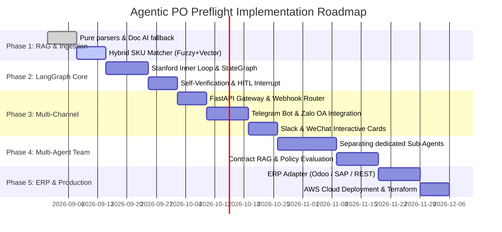

# PO PREFLIGHT PROJECT IMPLEMENTATION ROADMAP

> **Objective:** Build an Agentic AI system for automated purchase order (PO) reconciliation, combining RAG and LangGraph (Stanford Inner Loop + MIT Outer System), optimizing LLM cost, and enabling multi-channel approval via Telegram, Zalo, Slack, WeChat and the Web Portal.

---

---

## 🎯 PHASE DETAILS

### 📌 PHASE 1: HYBRID INGESTION & HYBRID SKU RAG (Week 1 - Week 2)
*Goal: Read every kind of order file (text PDF, scanned PDF, Excel, images, JSON) and search for SKU codes intelligently at close to zero token cost.*

- [x] **1.1. Deterministic Parsers:** Keep the pure Python parsers for JSON, CSV and text PDFs (0 tokens).
- [ ] **1.2. Multimodal Fallback:** Integrate `gemini-2.0-flash` or `gpt-4o-mini` with Pydantic Structured Output for complex image/scanned files (triggered only when the pure parser fails).
- [ ] **1.3. Hybrid SKU Matcher (3 tiers):**
  - *Tier 1 (Exact Match):* Look up SKU codes directly in the catalog (0 tokens).
  - *Tier 2 (Fuzzy Match):* Use `rapidfuzz` / Levenshtein Distance to catch minor spelling errors (0 tokens).
  - *Tier 3 (Vector Search):* Integrate `SQLite Vector` / `FastEmbed` to semantically match abbreviated product names or free-form descriptions.
- **Completion criteria (Deliverables):**
  - SKU recognition accuracy > 98%.
  - Processing cost for standard files = $0, for scanned image files < $0.002/order.

---

### 📌 PHASE 2: LANGGRAPH SINGLE-AGENT & HITL (Week 3 - Week 4)
*Goal: Build the LangGraph orchestration graph following the Stanford Inner Loop architecture (Reasoning + Self-Verification).*

- [ ] **2.1. LangGraph StateGraph Architecture:**
  - Define the `POState` state (raw_file, extracted_items, findings, risk_level, human_decision, audit_trail).
- [ ] **2.2. Deterministic Rule Node (Zero-Token):**
  - Integrate `rules.py` into the graph to check unit-price deviations, stock shortages and duplicate PO numbers.
- [ ] **2.3. Self-Verification & Reflection Node:**
  - Cross-check the calculations: Does the sum of the line totals match the `Grand Total` on the PO file?
  - If they do not match $\rightarrow$ Trigger the Inner Loop to re-read the mismatched region on its own.
- [ ] **2.4. Human-In-The-Loop (HITL) Interrupt:**
  - Configure `MemorySaver` / `PostgresSaver` and the `interrupt_before=["human_approval"]` breakpoint when risk is at the `MEDIUM` or `HIGH` level.
- **Completion criteria (Deliverables):**
  - The graph runs smoothly from extraction $\rightarrow$ rule checks $\rightarrow$ pausing to wait for an approval command $\rightarrow$ resuming the flow.

---

### 📌 PHASE 3: MULTI-CHANNEL APPROVAL (Week 5 - Week 7)
*Goal: Bring the order approval experience to Telegram, Zalo, Slack, WeChat and the Web Portal.*

- [ ] **3.1. FastAPI Webhook Gateway:**
  - Build a REST API that receives webhooks from chat platforms and verifies security signatures (HMAC SHA-256).
- [ ] **3.2. Telegram Bot Integration:**
  - Send PO cards in Markdown with `InlineKeyboardMarkup` (`[Duyệt]`, `[Từ chối]`, `[Yêu cầu chỉnh sửa]` — Approve, Reject, Request changes).
  - Handle the Callback Query when a manager taps a button $\rightarrow$ Resume the LangGraph state.
- [ ] **3.3. Zalo Official Account & ZNS:**
  - Integrate sending Zalo messages with action buttons (the best fit for businesses in Vietnam).
- [ ] **3.4. Slack App & WeChat Work:**
  - Integrate Slack Block Kit and WeChat Template Cards.
- [ ] **3.5. Web Portal Dashboard (`apps/web`):**
  - Connect the React/Next.js interface to FastAPI to show the list of orders awaiting approval and the Audit Log history in real time.
- **Completion criteria (Deliverables):**
  - Managers can approve orders directly on their phones via Telegram/Zalo in under 3 seconds.

---

### 📌 PHASE 4: MULTI-AGENT COLLABORATION TEAM (Week 8 - Week 10)
*Goal: Assign dedicated agents to the complex workflows of large enterprises.*

- [ ] **4.1. Ingestion Agent (Vision/Document AI):** Specialized in extracting data and normalizing layout.
- [ ] **4.2. Catalog & SKU Resolution Agent (RAG):** Specialized in resolving item codes and packaging units (box/carton).
- [ ] **4.3. Contract & Policy Auditor Agent:**
  - RAG lookup of framework contracts: volume discounts, credit limits, payment terms (Net 30/60).
- [ ] **4.4. Inventory & Warehouse Agent:** Checks stock across multiple branches/warehouses.
- [ ] **4.5. Supervisor / HITL Coordinator Agent:** Aggregates the report and routes approval authority according to the order value limit.
- **Completion criteria (Deliverables):**
  - The system automatically identifies the authorized approver (for example, orders > 100 million VND are routed to the Sales Director).

---

### 📌 PHASE 5: ERP INTEGRATION & PRODUCTION DEPLOYMENT (Week 11 - Week 12)
*Goal: Integrate automatic order posting into the ERP and deploy a highly secure cloud infrastructure.*

- [ ] **5.1. ERP Adapters:**
  - Build connectors that write Sales Orders to Odoo (XML-RPC / REST API), SAP Business One, or a Custom Database.
  - An Idempotency Key mechanism prevents duplicate writes, and Rollback is supported when network failures occur.
- [ ] **5.2. Audit Trail & Compliance:**
  - Store the entire history immutably in PostgreSQL: approver, time, IP, source file, extraction results.
- [ ] **5.3. AWS Cloud Deployment:**
  - Terraform automatically provisions the VPC, EC2/ECS, RDS PostgreSQL, S3 Encrypted Documents and Secrets Manager.
- **Completion criteria (Deliverables):**
  - The system operates fully end-to-end, from receiving a PO to the order being created in the ERP.

---

## 🛠️ TECH STACK BY TECHNOLOGY LAYER

| Functional Layer | Chosen Technology | Rationale |
| :--- | :--- | :--- |
| **Agent Framework** | `LangGraph`, `LangChain` | Currently the best at managing State, Memory and Human-in-the-loop Interrupts |
| **LLM & Vision** | `Gemini 2.0 Flash`, `GPT-4o-mini` | Extremely fast, very cheap, supports Structured Output & Prompt Caching |
| **Vector DB / RAG** | `SQLite Vector` / `FastEmbed` | Lightweight, embedded locally in SQLite with extremely fast brute-force cosine, 0 cloud dependency |
| **Fuzzy Matching** | `RapidFuzz` | An extremely fast C++ library for computing Levenshtein distance (0 tokens) |
| **Backend API** | `FastAPI`, `Pydantic v2` | High performance, async webhooks, strict schema validation |
| **Database & Cache** | `PostgreSQL`, `SQLite`, `Redis` | Manages the Audit Log, LangGraph state checkpoints and caching |
| **Messaging Channels**| `python-telegram-bot`, `zalo-sdk`, `slack-sdk` | Real-time multi-channel interaction |
| **Frontend** | `Next.js`, `TailwindCSS` | An intuitive dashboard for managing the order queue |
| **Infrastructure** | `Docker`, `Terraform`, `AWS (EC2, S3, RDS)` | Safe packaging, enterprise-grade security standards |
