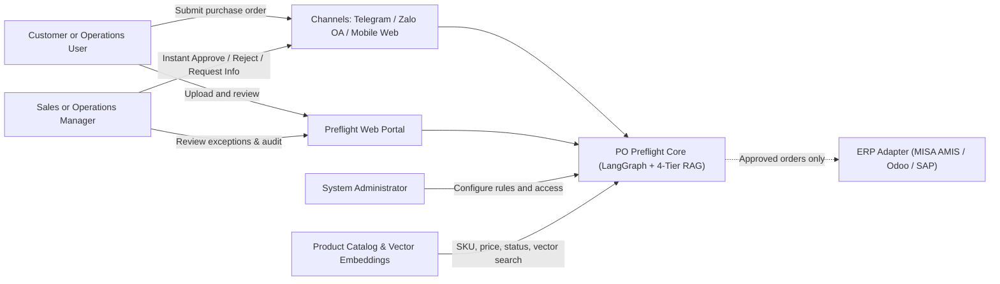
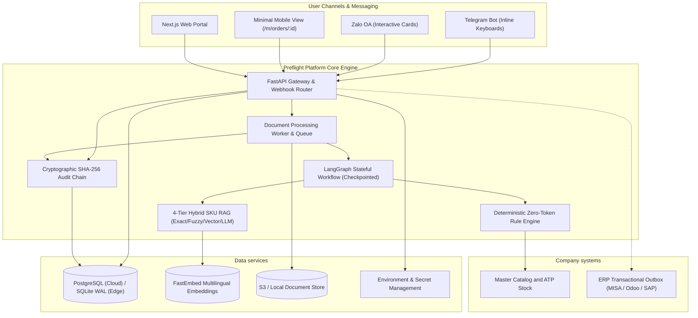
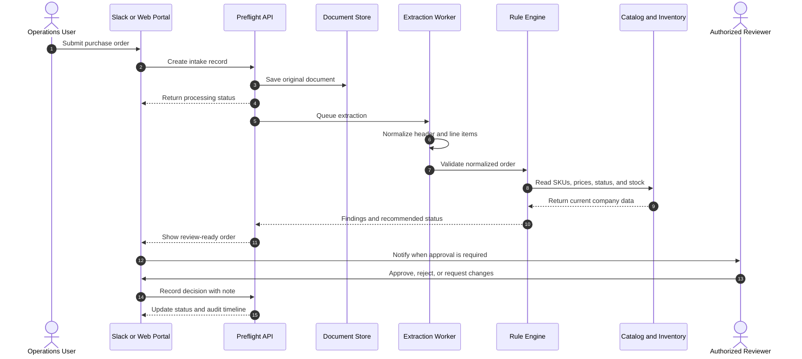
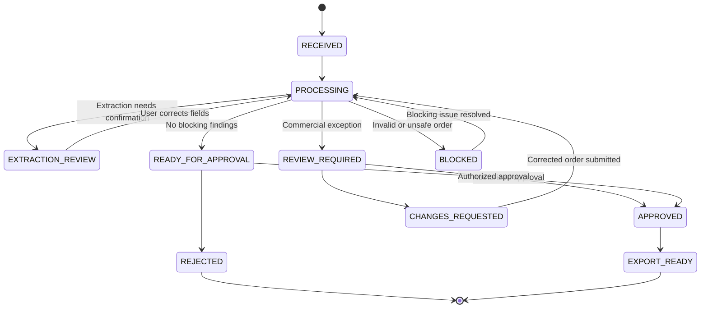
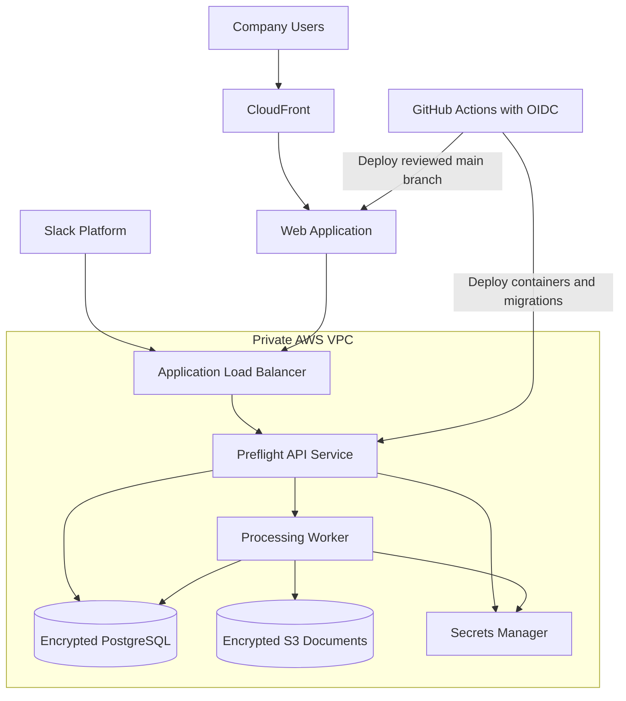

# PO Preflight Architecture

This document describes the concrete system architecture for PO Preflight and the path from single-tenant pilot to enterprise multi-tenant deployment.

## 1. System context



Preflight is the controlled intake layer between incoming purchase-order documents and downstream business systems. Multi-channel bots (Telegram, Zalo Official Account) and the web portal are unified interfaces to the same workflow and cryptographic audit trail.

### 1.1 AI-Native Design Philosophy

PO Preflight applies 5 core principles of modern AI-assisted systems to B2B order operations:

1. **High-Trust Grounding Evidence:** AI is never an opaque black box. Every validation finding provides explicit lineage and evidence (e.g., matching line 3 of the PO against Clause 2 of Customer Contract #2026-04).
2. **Proactive Background Processing (Zero-Wait):** Documents sent via email or portal are ingested and analyzed asynchronously in the background. Reviewers see instant results.
3. **Frictionless 1-Click Correction:** 98% of clean data is prepared automatically. For ambiguous lines, AI provides 1-click suggested corrections instead of forcing manual data re-entry.
4. **Context-Centric Reasoning:** Orders are evaluated in the holistic context of customer historical orders, custom pricing agreements, and past nickname resolutions.
5. **Human in Full Control:** AI acts as a tireless pre-flight co-pilot. Only an authenticated human decision triggers ERP synchronization.

## 2. Application containers



### Component status & implementation reality

| Component | Responsibility | Current status |
|---|---|---|
| **FastAPI Gateway** | Session/API-Key authentication, RBAC, B2B rule analysis, order management | **Live (Production Ready)** |
| **Next.js Web Portal** | React 19 / Next 16 interface on Vite: extraction, inline edit, audit log | **Live (Production Ready)** |
| **Telegram & Zalo OA Bots** | Push rich-card alert messages, webhook callbacks for 1-tap approval from mobile | **Live (Production Ready)** |
| **LangGraph Stateful Graph** | Workflow graph that interrupts to wait for Human-In-The-Loop approval, with SQLite/Postgres checkpointing | **Live (Production Ready)** |
| **4-Tier SKU Matcher** | Tier 1 Exact → Tier 2 Fuzzy → Tier 3 Vector (FastEmbed) → Tier 4 LLM fallback | **Live (Production Ready)** |
| **B2B Rule Engine** | Reconciliation of list price, contract, ATP stock, overdue receivables, and UOM specifications | **Live (Production Ready)** |
| **ERP Transactional Outbox** | Idempotent ERP export queue supporting MISA AMIS, Odoo, SAP S/4HANA | **Live (Production Ready)** |
| **SHA-256 Hash Chain** | Tamper-evident cryptographic log attesting to the immutability of decisions | **Live (Production Ready)** |
| **Email Intake Worker** | Periodic IMAP worker that ingests PO attachments, with a lock to prevent duplicate processing | **Live (Production Ready)** |
| **Slack & WeChat Auxiliary Channels** | Extended integrations for Slack Block Kit and WeChat Work | **Planned expansion (Roadmap)** |

## 3. Order processing sequence



## 4. Workflow state model



Only explicit actions by authorized users can move an order into `APPROVED`. AI output never bypasses workflow policy.

## 5. AWS deployment topology



The first internal deployment may use one private EC2 instance for cost and speed. The target topology separates the web application, API, worker, database, and document storage so the system can scale and meet customer security requirements.

## 6. Trust boundaries and controls

- Original purchase orders are untrusted input and must be scanned, size-limited, and parsed in an isolated worker.
- AI extraction produces a proposal, not an authoritative transaction.
- Deterministic rules own SKU, pricing, inventory, duplicate, and policy outcomes.
- All decisions require an authenticated actor and append-only audit event.
- Customer data is isolated by tenant in every business record and storage path.
- Secrets are injected at runtime and never stored in Git or browser code.
- ERP writes remain disabled until an adapter has idempotency, authorization, reconciliation, and rollback controls.

## 7. Monorepo target

```text
po-preflight/
├── apps/
│   ├── api/                 # FastAPI product API
│   └── web/                 # Next.js customer portal and prototype
├── packages/
│   ├── preflight-core/      # Parsing and deterministic validation
│   └── contracts/           # Shared API and event schemas
├── integrations/
│   ├── telegram/
│   ├── zalo/
│   ├── slack/
│   └── erp/
├── infra/terraform/
├── docs/
└── tests/
```

The repository can migrate toward this layout incrementally. The current Python core remains the working validation engine while the web portal and API boundaries are added.
