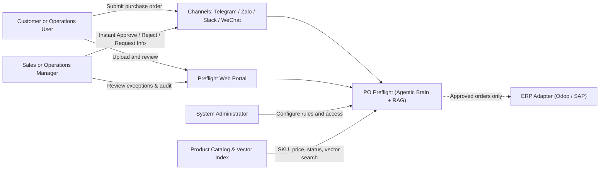
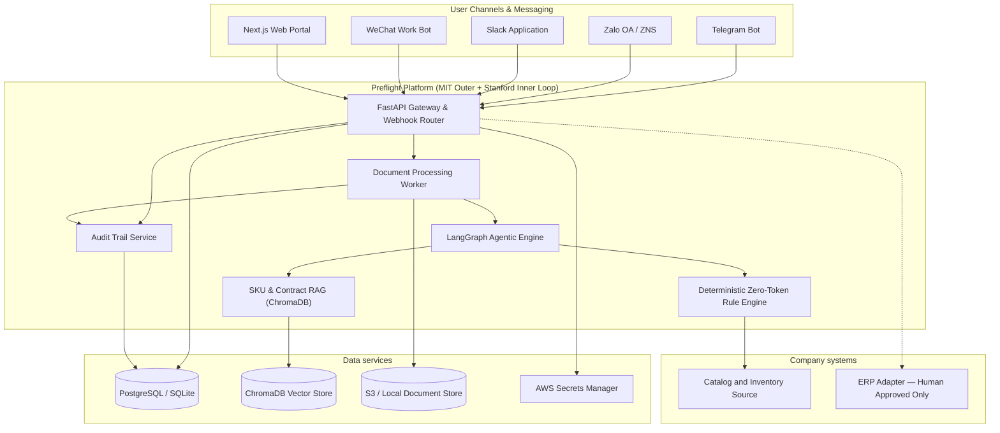
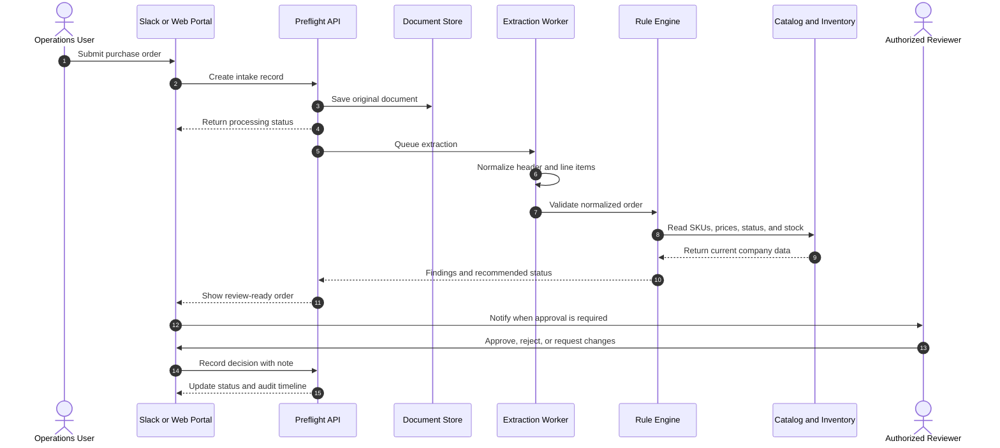
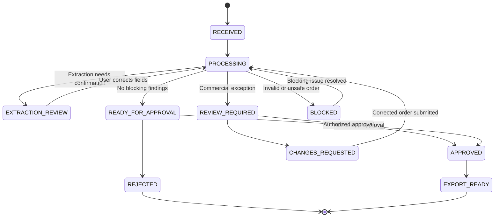
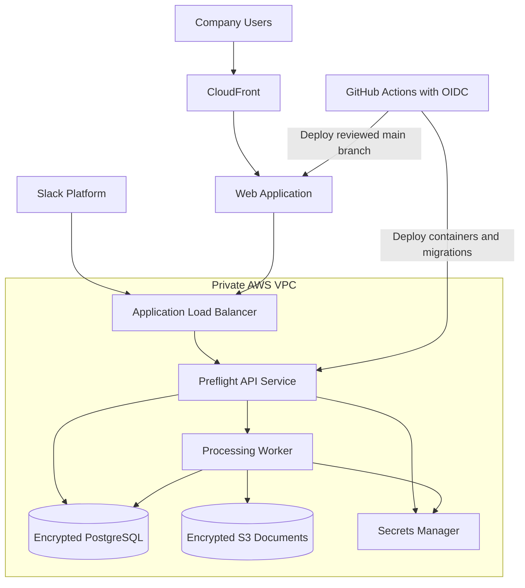

# PO Preflight Architecture

This document describes the target architecture for PO Preflight and the path from a local demonstration to an enterprise multi-agent & multi-channel deployment.

## 1. System context



Preflight is the controlled intake layer between incoming purchase-order documents and downstream business systems. Multi-channel bots (Telegram, Zalo, Slack, WeChat) and the web portal are interfaces to the same workflow and audit trail.

## 2. Application containers



### Component responsibilities

| Component | Responsibility | MVP status |
|---|---|---|
| Next.js web portal | Upload, review, approval, search, and audit experience | Interactive prototype |
| Slack application | Submit orders and act on exception notifications | Planned |
| FastAPI application | Authentication, workflow state, business API, and integration boundary | Planned |
| Document worker | Extraction, normalization, validation orchestration, and retries | Local core available |
| Preflight core | Parsers, deterministic rules, reports, and audit decisions | Implemented |
| OpenClaw | AI-assisted extraction, explanation, channel orchestration, and skills | Local skill implemented |
| PostgreSQL | Durable orders, findings, decisions, rules, and tenant data | Planned; SQLite used locally |
| S3 | Original documents and generated artifacts | Planned for AWS |

## 3. Order processing sequence



## 4. Workflow state model



Only explicit actions by authorized users can move an order into `APPROVED`. AI output never bypasses workflow policy.

## 5. AWS deployment topology



The first internal deployment may use one private EC2 instance for cost and speed. The target topology separates the web application, API, worker, database, and document storage so the system can scale and meet customer security requirements.

## 6. Trust boundaries and controls

- Original purchase orders are untrusted input and must be scanned, size-limited, and parsed in an isolated worker.
- AI extraction produces a proposal, not an authoritative transaction.
- Deterministic rules own SKU, pricing, inventory, duplicate, and policy outcomes.
- All decisions require an authenticated actor and append-only audit event.
- Customer data is isolated by tenant in every business record and storage path.
- Secrets are injected at runtime and never stored in Git or browser code.
- ERP writes remain disabled until an adapter has idempotency, authorization, reconciliation, and rollback controls.

## 7. Monorepo target

```text
po-preflight/
├── apps/
│   ├── api/                 # FastAPI product API
│   └── web/                 # Next.js customer portal and prototype
├── packages/
│   ├── preflight-core/      # Parsing and deterministic validation
│   └── contracts/           # Shared API and event schemas
├── integrations/
│   ├── openclaw/
│   ├── slack/
│   └── erp/
├── infra/terraform/
├── docs/
└── tests/
```

The repository can migrate toward this layout incrementally. The current Python core remains the working validation engine while the web portal and API boundaries are added.
